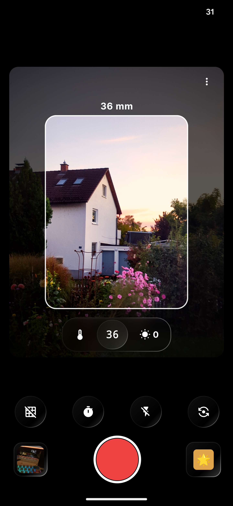
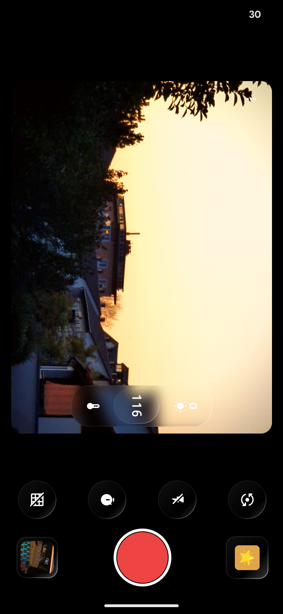
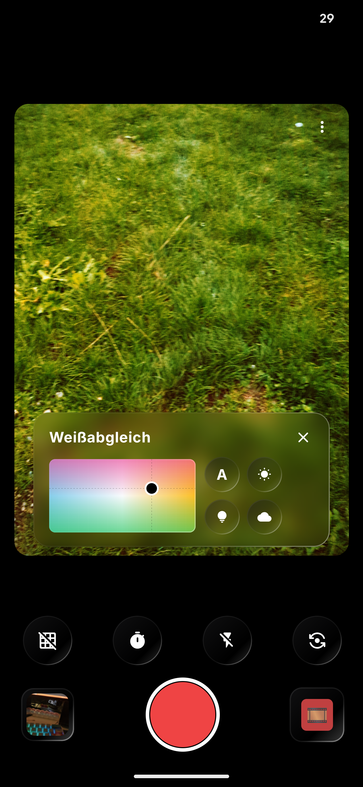
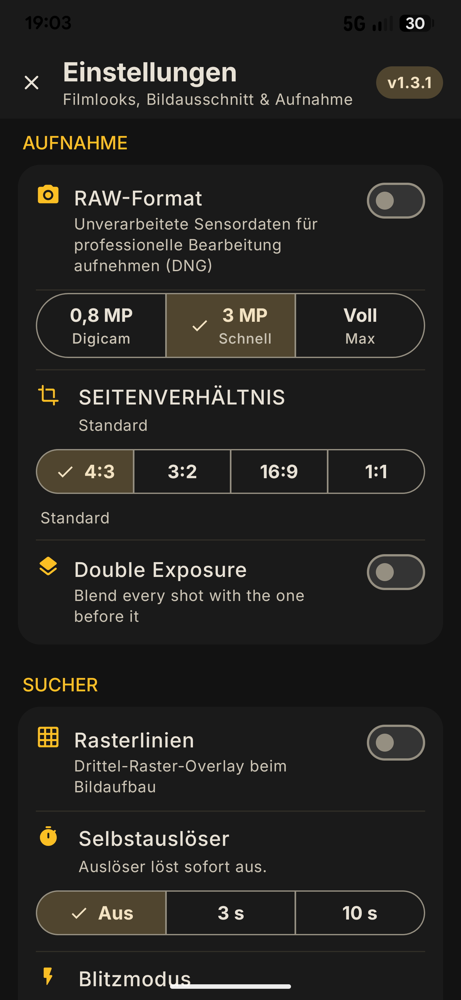

<div align="center">

  

  <h1>Zoom Box Camera</h1>

  <p><em>Retro film looks, modern camera engineering.</em></p>

  <p>
    
    
    
    
    
  </p>

</div>

---

**Zoom Box Camera** is a retro-themed Android camera app built with **Jetpack Compose** and **CameraX**. A live *Zoom Box* framing overlay shows the exact crop area before you shoot, paired with vintage film color processing, 3D LUT grading, and full manual controls — the darkroom, back in your pocket.

> 💡 **Have a feature request?** Open an [issue](https://github.com/Indukto/zoom-box/issues) 

##  Screenshots

<div align="center">

  
  

  <br/>

  
  

</div>

---

##  Features

### Frame 

- **Zoom Box** — A live 4:3 overlay on the viewfinder that previews the final crop. Digital zoom (1×–3×) scales the box, so you frame *exactly* what gets saved.
- **Multi-lens** — Ultra-wide, Primary (with digital zoom), and Tele. Digital zoom uses a center crop from the full sensor.
- **Manual controls** — Exposure compensation (−3 to +3 EV in ⅒ stops), a color temperature/tint plot, flash modes, grid lines, and a self-timer (3/5/10 s).

### Film 

- **13 film looks** — Warm Portrait, Monochrome 400, Instant Classic, Cross Process, Instant Vintage, Moody, Muted Meadow, Sunlit Spill, Golden 200, Street Mono 400, Vivid Cool 400, CCD Digicam, and Normal (pass-through). Each is defined by a 3D LUT plus per-look tonal parameters.
- **JSON look profiles** — Every look is fully described by an editable `assets/cameras/*.json` file, and the Film-Style picker is built from the loaded catalog: a look with no `FilmPreset` entry still shows up in the grid and in the swipe cycle. The capture pipeline prefers the JSON and falls back to the built-in enum, so adding or tuning a look is an *asset change, not a code change*.
- **Film processing pipeline** — One shared `RetroRenderParams` snapshot (LUT + film curve, contrast/saturation, split toning, bloom, fringing, soft focus, milky haze, grain, artifacts) drives all three render back-ends with a single signal chain:
  - **Live preview** — GLES fragment shader (grain + vignette shown in the viewfinder; dust/scratches/light-leak are capture-only).
  - **CPU capture** — Pixel filter applied to the saved JPEG.
  - **GPU capture** — Offscreen EGL processor reusing the exact same preview shader, on by default with automatic CPU fallback on any failure.
- **Film artifacts** — Highlight roll-off (filmic shoulder), black-point fade, parametric vignette, procedural film grain (value-noise, midtone-weighted, optional chroma for dye-cloud/CCD speckle), plus procedurally generated dust specks, vertical scratches, and warm corner light leaks — **no texture assets required**.

###  Capture & manage

- **Double exposure** — Screen-blends each shot with the previous one (the retained frame is downscaled to a 1080 px ghost, so the effect costs a few MB rather than a second 12 MP frame). Applied after the film grade, so both "exposures" carry the same look.
- **RAW (DNG)** — Full-resolution RAW via the Camera2 API, captured in parallel to JPEG, with per-lens detection.
- **In-app gallery** — A film-card layout with EXIF metadata, plus share and delete.

###  Privacy & legal

- **Fully offline** — no `INTERNET` permission: Android blocks all network access. No ads, no analytics, no trackers, no crash reporting. Photos never leave the device (sharing is user-initiated), and no GPS/location data is written into photos.
- **In-app legal pages** — Settings → Legal: Privacy (GDPR), Impressum (§ 5 DDG) and open-source licenses, fully bilingual (English + German).
- **Play Store / EU compliance** — Submission docs (Data safety answers, hosted privacy policy, imprint, DSA/GPSR checklist, store listing texts) live in [`docs/play-store/`](docs/play-store/README.md).

---

##  Film Looks

Each look combines a `.cube` 3D LUT (in `app/src/main/assets/luts/`) with per-look defaults — grain strength/chroma, film S-curve, contrast, saturation, bloom, split toning, fringing, soft focus, milky haze, highlight roll-off, fade, vignette, dust, scratches, and light leak — all expressed in the look's JSON profile.

| Look | Vibe |
|---|---|
| 🌸 Warm Portrait | Soft, flattering skin tones |
| ⚫ Monochrome 400 | Classic black & white |
| 🧊 Instant Classic | Clean instant-film neutrality |
| 🎞️ Cross Process | Wild, shifted color chemistry |
| 📸 Instant Vintage | Aged instant-film warmth |
| 🌧️ Moody | Low-key, cinematic shadows |
| 🍃 Muted Meadow | Desaturated, earthy calm |
| ☀️ Sunlit Spill | Golden-hour glow |
| 🌇 Golden 200 | Warm 200-speed color negative |
| 🏙️ Street Mono 400 | Gritty monochrome for the city |
| 💠 Vivid Cool 400 | Punchy, cool-toned saturation |
| 📀 CCD Digicam | Early digital-sensor nostalgia |
| ✨ Normal | Pure pass-through, no grade |

The four newest looks (Golden 200, Street Mono 400, Vivid Cool 400, CCD Digicam) use LUTs adapted from the MIT-licensed DAZZ Retro Camera reference and renamed to avoid third-party trademarks — see `app/src/main/assets/luts/NOTICE.txt` for provenance.

---

##  Tech Stack

| Layer | Tech |
|---|---|
| UI | Jetpack Compose + Material 3 (Expressive, dynamic color) |
| Camera | CameraX (Preview + ImageCapture) + Camera2 (RAW) |
| Arch | MVVM (ViewModel + StateFlow) |
| Async | Kotlin Coroutines & Flow |
| Effects | GLES fragment shaders, CPU pixel filter, EGL offscreen capture, Adobe `.cube` 3D LUT |
| Look profiles | JSON in `assets/cameras/` (model + loader + registry in `com.example.color`) |
| Persistence | Jetpack DataStore |
| Build | Gradle + Kotlin DSL (Kotlin 2.2, AGP 9) |

---

##  Getting Started

**Prerequisites:** [Android Studio Ladybug (2024.2.1)+](https://developer.android.com/studio), a device or emulator on **API 29+**.

```bash
git clone https://github.com/Indukto/zoom-box.git
cd zoom-box
```

Open the project in Android Studio, sync Gradle, and hit **Run**. That's it — no API keys, no configuration.

---

##  Testing

Compile the app:

```bash
./gradlew :app:compileDebugKotlin
```

Run the JVM tests for the color pipeline (preset → params mapping, JSON profile parsing, JSON ↔ enum parity, catalog/picker lookups, the CPU filter's behavior locks and the double-exposure blend), which live in `app/src/test/java/com/example/color/`:

```bash
./gradlew :app:testDebugUnitTest --tests "com.example.color.*"
```

The CPU filter also ships an opt-in benchmark (1 warm-up + 5 timed runs over a 4000x3000 frame, printing median/min ms plus an output checksum):

```bash
RETRO_BENCH=1 ./gradlew :app:testDebugUnitTest --tests "com.example.color.RetroFilterBenchmark"
```

The full suite compiles and passes with `./gradlew :app:testDebugUnitTest`.

---

##  License

This project is licensed under the [GNU General Public License v3.0](LICENSE).
